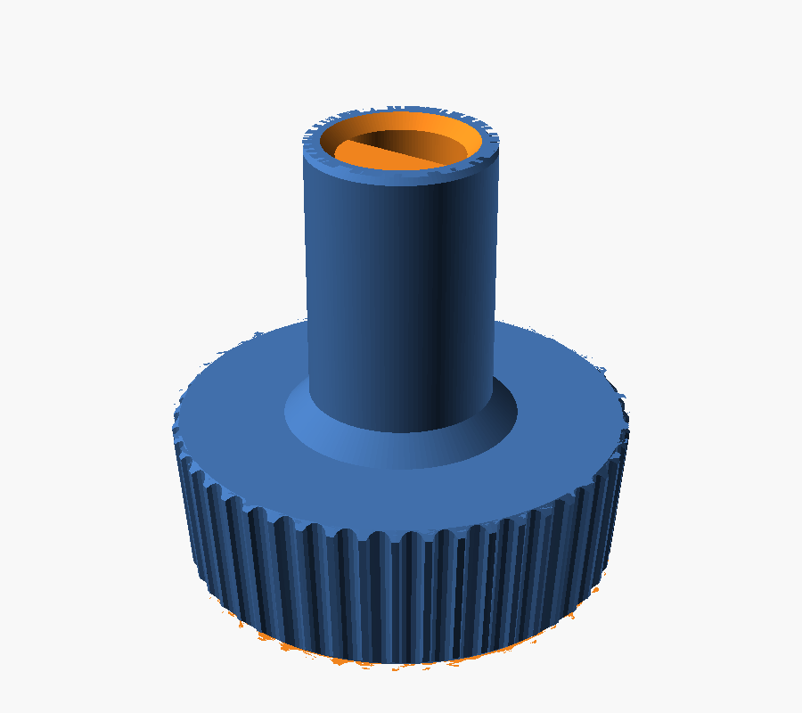
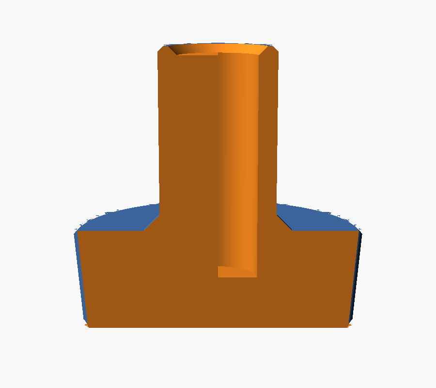

# NuTone range-hood control knob — 3D-printed replacement

A replacement for the broken control knob on a NuTone kitchen range hood (the "exhaust
ON·OFF·LOW / SOLID STATE" panel). The original is a sixty-ish-year-old moulded knob whose
socket had split.

**Status: printed and working.** ✅ The part as modelled here fits the hood's shaft and drives
the switch. See [What the print confirmed](#what-the-print-confirmed).



## The part

```
        <-------- 27.35 back -------->      the dial you turn, knurled,
         ___________________________        tapering to 25.80 at the front
        |                           |       9.50 tall
        |___________________________|
                |         |                 <- stem 11.00, parallel
                |         |                    17.00 long
                |  Ø7.00  |                    2.00 of wall around the bore
                |  D bore |
                |_________|

                overall 26.50 = 9.50 + 17.00
```

**The overall height is derived, never entered** — it is dial + stem and nothing else, so the
two heights cannot disagree with a third number.



## Files

| | |
|---|---|
| `nutone_knob.scad` | the model — every dimension is one variable at the top |
| `nutone_knob.stl` | the knob, ready to print |
| `nutone_knob_gauge.stl` | fit gauge, six stations, ~2 min print |
| `check_stl.py` | is the mesh one solid, closed, and grounded? |
| `measure_stl.py` | is it the right size? measures the STL, not the model's arithmetic |
| `clean_stl.py` | drops zero-area facets from the export |

## Printing

- **Orientation: front face DOWN on the plate, stem pointing up.** The bore then prints as a
  clean vertical blind hole needing no support, and elephant foot lands on the dial's front
  rim where the 0.60 chamfer absorbs it, not on a fit surface. Stem-down would put the splay
  right at the bore mouth — the one place it must not be — and need support under the dial.
- **No supports needed anywhere.** The dial's taper is 2.6° off vertical and the gusset is a
  45° cone; both are self-supporting.
- 0.16 mm layers, **4 walls**, 30–40 % infill.
- ⚠ **Walls, not infill, resist the twist.** Torque tries to shear the stem along the layer
  lines, which is FDM's weak direction — hence four perimeters. The 1.5 mm gusset at the
  stem/dial junction is there for the same reason: that corner is where the original broke.

### Material

PLA prints this fine and is the most dimensionally predictable choice. The reservation is
that this is a **range hood** — PLA softens around 60 °C and creeps under sustained load, and
a knob pressed onto a shaft is under constant load. PETG (~80 °C) or ASA (~100 °C) have real
margin. If the panel on your hood runs warm, use one of those for the keeper.

## Print the gauge first

Two minutes, against a shaft you would otherwise be guessing at.

```bash
openscad -D 'part="gauge"' -o nutone_knob_gauge.stl nutone_knob.scad
```

Six stations: five D sockets stepping the bore, one plain round hole as a control.

- **A D station grips firmly and square** → that is your number. Set `socket_fit` so `bore_d`
  matches it, re-export, print the knob.
- **No D station goes on but the round control does** → the bore is fine and the **flat** is
  wrong. Measure flat face → opposite arc and raise `shaft_flat`.
- **Nothing goes on at all** → `shaft_d` is under. Raise it.

| Station | Modelled bore | Prints about |
|---|---|---|
| `14` | 7.14 | 6.95 — tight |
| `24` | 7.24 | 7.05 |
| `34` | 7.34 | **7.15 — the knob's default** |
| `44` | 7.44 | 7.25 |
| `54` | 7.54 | 7.35 — loose |
| `RND` | 7.34 round, no flat | control |

## The measurements

All taken with calipers on the shaft and the old knob.

| | |
|---|---|
| `shaft_d` 7.00 | across the shaft's round part at its widest, measured on the **shaft** — a cracked socket splays and reads oversize |
| `stem_d` 11.00 | parallel, does not taper |
| `stem_l` 17.00 | how far the stem stands off the back of the dial |
| `grip_d_back` 27.35 | widest, against the panel |
| `grip_d_front` 25.80 | the face you look at |
| `grip_t` 9.50 | the dial's own height |

⚠ **Do not scale these off photographs.** An earlier revision derived the dial from the
photos and got 22.7 against a real 27.35 — 20 % out. Photographs settle the *shape* on this
job; they have no business setting a *size*. Where a caliper reading and a pixel ratio
disagreed here, the pixels were wrong every time.

## Printer compensation

Built on a Bambu A1 mini's **measured** behaviour, not published ranges. Three effects, all
compensated in the model so the STL is correct whoever slices it:

| Effect | Value | Applied as |
|---|---|---|
| Holes print under | `hole_shrink` 0.19 | bore drawn **over**: `7.00 + 0.19 + 0.15 fit = 7.34` |
| Outsides print over | `ext_grow` 0.15 | every outer dia drawn **under**: 25.80 → 25.65 |
| Elephant foot | `foot_chamfer` 0.60 | chamfer on the front face, which sits on the plate |

0.19 is interpolated for Ø7 between measured 0.20 at Ø6 and 0.15 at Ø10; shrinkage scales
with hole-to-nozzle ratio, so the small-hole figure does not carry across.

This is why the STL measures "wrong" in a viewer — 25.65 where you expect 25.80. It is drawn
small on purpose so it comes off the plate at size.

⚠ **If you enable X-Y hole/contour compensation or elephant-foot compensation in your slicer,
zero `hole_shrink`, `ext_grow` and `foot_chamfer` here** — otherwise it is applied twice and
the socket comes out ~0.19 too loose.

## What the print confirmed

The knob printed from `nutone_knob.stl` fits the shaft and drives the switch. That retires the
last open assumption:

- ✅ **`shaft_flat` = 3.50 — the shaft really is a true half-round**, flat through the centre.
  This was an inference from the words "a half circle" and was the single most likely thing
  to be wrong. The part going on proves it.
- ✅ **The bore at 7.34 modelled is right** — the 0.19 hole-shrink and 0.15 clearance together
  land where they should on a 7.00 shaft.
- ✅ **The compensation figures carry to this part**, at least in the material used for this
  print. (Material for the successful print is not recorded here — worth noting if you
  reprint in something else, since PETG and PLA do not shrink identically.)

## Verified dimensions

Measured back off the exported STL with `measure_stl.py`, not taken from the model:

| Feature | Modelled | Prints |
|---|---|---|
| Overall height | 26.50 | — |
| Dial, front | 25.65 | 25.80 |
| Dial, back (widest, z=9.04) | 27.13 | 27.28 |
| Stem (z 9.50 → 26.00) | 10.85 | 11.00 |
| Bore | 7.34, flat on centre | ~7.15 |
| Wall around bore | 1.76 | 1.93 |
| Front face | 5.00 solid | socket 21.50 deep |

## If it does not fit

Every fit is one variable at the top of the `.scad`. Change one, re-export, re-verify.

| Symptom | Change |
|---|---|
| Socket will not start on the shaft | raise `socket_fit` (0.15 → 0.25) |
| Socket goes on but the knob spins | lower `socket_fit`; if it still spins, `shaft_flat` is too big — the flat is not driving |
| No bore goes on, round control does | lower `shaft_flat` — the flat is cut deeper than half |
| Knob will not seat flush to the panel | raise socket depth: lower `front_wall` (5.00 → 3.00) |
| Knob stands too proud / too deep | change `grip_t` or `stem_l`; overall follows automatically |
| Stem splits while pressing on | raise `socket_fit`, print PETG, raise `fillet` |
| Knurl feels smooth | raise `flute_depth` (0.45 → 0.60) or lower `flutes` (48 → 36) |

## Verifying an export

```bash
openscad -D 'part="knob"' -o nutone_knob.stl nutone_knob.scad \
  && python3 clean_stl.py nutone_knob.stl \
  && ./check_stl.py nutone_knob.stl \
  && ./measure_stl.py nutone_knob.stl
```

`clean_stl.py` is needed because where a chamfer cone meets a flank the two surfaces are
tangent along a ring, and CGAL tessellates that into zero-area slivers (48 on the current
version). They enclose no volume but leave edges pairing with nothing, so `check_stl.py`
counts them as open. Dropping them took the count to **zero**, which is the proof there was
never a hole — a real hole would have survived the drop. **Always re-run `check_stl.py` after
cleaning**; the cleaner is not trusted on its own say-so.

## Not modelled

The white printed insert in the original's front face. `insert_recess = false` ships a flat
front — the insert's diameter was never measured, and printing front-face-down turns a recess
into a bridged ceiling. Options: reuse the original insert glued to the flat front, or set
`insert_recess = true` with a real `insert_d` and accept the bridge.
